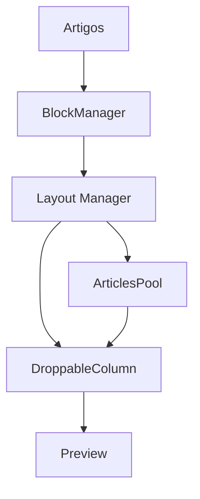

# BlockManagerDragDrop - Documentação Técnica

## Visão Geral

O BlockManagerDragDrop é um sistema complexo de gerenciamento de blocos de conteúdo que permite a organização e configuração de artigos em diferentes layouts através de uma interface drag-and-drop. O sistema suporta múltiplos tipos de layouts, cada um com suas próprias regras e configurações.

## Índice

1. [Arquitetura do Sistema](./architecture.md)
2. [Gerenciadores de Layout](./layout-managers.md)
3. [Sistema de Drag and Drop](./drag-drop-system.md)
4. [Gerenciamento de Estado](./state-management.md)
5. [Componentes Principais](./core-components.md)

## Principais Características

- **Múltiplos Layouts**: Suporte para diferentes tipos de layout (Grid, List, Mixed)
- **Drag and Drop**: Sistema intuitivo de arrastar e soltar com suporte para multi-seleção
- **Gerenciamento de Estado**: Sistema robusto de gerenciamento de estado usando hooks customizados
- **Configuração Visual**: Interface para configuração de estilos e comportamentos
- **Preview em Tempo Real**: Visualização instantânea das mudanças
- **Responsividade**: Adaptação para diferentes tamanhos de tela
- **Filtros e Busca**: Sistema avançado de filtragem de artigos
- **Integração com API**: Sistema de salvamento e carregamento de dados

## Pontos Críticos

1. **Gerenciamento de Estado**
   - O estado é gerenciado através do hook `useBlockState`
   - Mudanças de estado devem ser feitas através das funções fornecidas pelo hook
   - Evitar mutações diretas do estado

2. **Performance**
   - Uso de `useMemo` e `useCallback` para otimização
   - Evitar re-renders desnecessários
   - Cuidado com containers de scroll aninhados

3. **Tipagem**
   - Sistema fortemente tipado com TypeScript
   - Interfaces bem definidas para props e estado
   - Validação de tipos em tempo de compilação

4. **Compatibilidade**
   - Suporte para temas claro e escuro
   - Adaptação para diferentes tamanhos de tela
   - Compatibilidade com diferentes navegadores

## Fluxo de Dados



## Começando

Para usar o BlockManagerDragDrop em um novo projeto:

```tsx
import { BlockManagerDragDrop } from './components/BlockManagerDragDrop';

const MyComponent = () => {
  return (
    <BlockManagerDragDrop
      pageId="my-page"
      articles={articles}
      variant="grid"
      onSave={handleSave}
      blockConfig={config}
    />
  );
};
```

## Boas Práticas

1. **Gerenciamento de Estado**
   - Sempre use as funções fornecidas pelo `useBlockState`
   - Evite mutações diretas do estado
   - Mantenha a imutabilidade dos dados

2. **Performance**
   - Use `React.memo()` para componentes que não precisam re-renderizar
   - Implemente `useCallback` para funções passadas como props
   - Utilize `useMemo` para cálculos pesados

3. **Tipagem**
   - Mantenha as interfaces atualizadas
   - Use tipos estritos quando possível
   - Evite uso de `any`

4. **Componentes**
   - Mantenha componentes pequenos e focados
   - Implemente prop-types ou TypeScript
   - Documente props e comportamentos esperados

## Troubleshooting

### Problemas Comuns

1. **Estado não atualiza corretamente**
   - Verifique se está usando as funções do `useBlockState`
   - Confirme que não há mutações diretas do estado
   - Verifique as dependências dos hooks

2. **Performance**
   - Verifique re-renders desnecessários com React DevTools
   - Confirme que `useMemo` e `useCallback` estão sendo usados corretamente
   - Verifique se há containers de scroll aninhados

3. **Drag and Drop**
   - Confirme que os IDs dos artigos são únicos
   - Verifique se as colunas têm altura suficiente
   - Confirme que o estado está sendo atualizado corretamente

## Contribuindo

1. Mantenha a documentação atualizada
2. Siga os padrões de código estabelecidos
3. Adicione testes para novas funcionalidades
4. Atualize o changelog

## Links Úteis

- [Documentação do React Beautiful DND](https://github.com/atlassian/react-beautiful-dnd)
- [TypeScript Handbook](https://www.typescriptlang.org/docs/handbook/intro.html)
- [React Performance](https://reactjs.org/docs/optimizing-performance.html) 